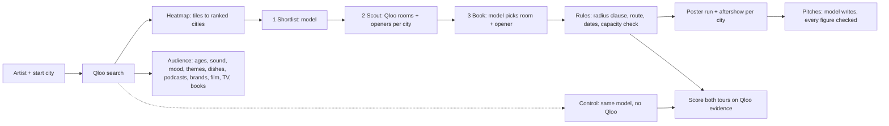

<p align="center"></p>

<p align="center">
  <a href="https://routed-tours.vercel.app"></a>
  
  
  
  <a href="https://github.com/RohanGlitched/routed/actions/workflows/ci.yml"></a>
  <a href="LICENSE"></a>
</p>

<p align="center">
  <b><a href="https://routed-tours.vercel.app">Route a tour</a></b> ·
  <b><a href="https://routed-tours.vercel.app/proof">With and without Qloo</a></b> ·
  <b><a href="https://routed-tours.vercel.app/how">How it works</a></b>
</p>

**Routed is a booking agent for independent artists.** Name an artist and a starting city. An agent reads Qloo's taste graph to find the cities where that artist's fans over-index, the rooms those fans already go to and the artists who share their audience, then routes and dates the tour by rule, checks each room's capacity, and drafts a hold request for every venue with each figure traced to its source. The tour poster prints itself from the data: every dot on the map is a tile of the artist's Qloo heatmap.

Then it does the work around the tour from the same audience across the rest of Qloo's graph: the podcasts to pitch, the brands to approach, the themes to write to, the record stores and cafés for the poster run in each city, and the bars for the aftershow.

And every tour runs twice. Before the agent looks anything up, the same model routes the same shows from what it already knows, and both tours are scored on the artist's own Qloo evidence, so the tour book shows what the taste graph changed.

## Why it needs Qloo

A manager deciding where to play has a streaming dashboard that counts plays, not people who'd buy a ticket, and a model that knows which cities are big. Neither says where *this* artist's fans are unusually dense, which rooms they go to, or who they'd also turn up for. That is exactly what Qloo's graph holds.

| Question a booker asks | Qloo call |
|---|---|
| Where do this artist's fans over-index? | `/v2/insights` `filter.type=urn:heatmap`, `signal.interests.entities=<artist>`, `filter.location.query` (or a WKT polygon for Europe) |
| Which rooms in that city do those fans go to? | `/v2/insights` `filter.type=urn:entity:place`, `filter.tags=urn:tag:genre:place:live_music_venue,…concert_hall`, `filter.location.query=<city>` |
| Who should open? | `/v2/insights` `filter.type=urn:entity:artist`, `signal.location.query=<city>`, `filter.popularity.max=<headliner>` |
| Who are the fans? All-ages or 21+? | `/v2/insights` `filter.type=urn:demographics` |
| What do they listen to, how do they talk about it, what themes land? | `/v2/insights` `filter.type=urn:tag` with `filter.tag.types` = `urn:tag:genre:music`, `urn:tag:artist:qloo`, `urn:tag:theme:qloo` |
| Which podcasts, brands, films, TV and books? | `/v2/insights` `filter.type=urn:entity:podcast` / `brand` / `movie` / `tv_show` / `book` |
| Which dishes do they seek out? | `/v2/insights` `filter.type=urn:tag`, `filter.tag.types=urn:tag:specialty_dish:place` |
| Where would they see a poster, and go after? | `/v2/insights` `filter.type=urn:entity:place` with record store, bookshop and café tags, then bar tags, per city |
| Is the audience growing? | `/v2/trending` |
| How well does each room match, ours and the model's? | `/v2/insights` `filter.type=urn:entity:place`, `filter.results.entities=<every room on both tours>` |

A typical eight-show tour makes about 55 Qloo calls. Every one is listed, with its plain-words question, the exact request (never the key) and the answer, at the end of its tour book.

## With and without Qloo

Fourteen artists, eight shows each, run on the live site. The same model (Nemotron 3 Ultra), starting city and crowd size on both sides; the model alone gets the artist's name, Routed's agent gets Qloo. Each number is the average rank of a tour's cities among every city where Qloo found that artist's fans (lower is closer to the fans).

**Routed's cities averaged #6.7. The same model without Qloo averaged #26.1.**

| Artist | Routed | Model alone | Cities in common | Strongest city the model missed | Weakest city it chose |
|---|---|---|---|---|---|
| [Tyler Childers](https://routed-tours.vercel.app/tour/sdagxkp8gm) | #7.3 | #83.3 | 2 of 8 | Calgary (#1) | Chicago (#204) |
| [Caamp](https://routed-tours.vercel.app/tour/4qwt7mque3) | #7.4 | #44.6 | 2 of 8 | Boulder (#2) | Detroit (#117) |
| [Khruangbin](https://routed-tours.vercel.app/tour/2m67zmzkrr) | #4.6 | #38.1 | 2 of 8 | San Francisco (#1) | Atlanta (#74) |
| [Waxahatchee](https://routed-tours.vercel.app/tour/mnhd55duvy) | #10.0 | #41.5 | 2 of 8 | Portland (#1) | Atlanta (#113) |
| [MJ Lenderman](https://routed-tours.vercel.app/tour/a4qrqq54ie) | #5.3 | #32.5 | 4 of 8 | Chicago (#1) | Louisville (#104) |
| [Zach Bryan](https://routed-tours.vercel.app/tour/xdvfdj75mk) | #7.4 | #28.6 | 2 of 8 | Knoxville (#2) | Chicago (#90) |
| [Clairo](https://routed-tours.vercel.app/tour/bgwwqbrpvi) | #6.4 | #20.8 | 2 of 8 | Los Angeles (#1) | Detroit (#45) |
| [Turnstile](https://routed-tours.vercel.app/tour/g7s28i8yg5) | #6.3 | #15.1 | 4 of 8 | Los Angeles (#3) | Detroit (#35) |
| [Parcels](https://routed-tours.vercel.app/tour/tzfgyayvcf) | #6.0 | #14.6 | 5 of 8 | Lyon (#6) | Oslo (#52) |
| [Japanese Breakfast](https://routed-tours.vercel.app/tour/cmmfwx684m) | #5.0 | #10.9 | 5 of 8 | Montréal (#4) | Denver (#27) |
| [Alvvays](https://routed-tours.vercel.app/tour/7avtndas55) | #4.8 | #10.5 | 3 of 8 | San Francisco (#1) | Detroit (#21) |
| [Wet Leg](https://routed-tours.vercel.app/tour/pdhj49duus) | #6.6 | #8.3 | 4 of 8 | Norwich (#20) | Birmingham (#16) |
| [Arlo Parks](https://routed-tours.vercel.app/tour/vxcr7ssgef) | #8.6 | #9.5 | 4 of 8 | Edinburgh (#9) | Southampton (#25) |
| [Fontaines D.C.](https://routed-tours.vercel.app/tour/vhcf3evf6t) | #8.7 | #6.9 | 4 of 8 | Edinburgh (#10) | Birmingham (#13) |

The gap closes in the UK, where touring cities are few and the biggest ones are also where the fans are; for Fontaines D.C. the model alone did slightly better. Qloo earns its keep where an artist's audience doesn't follow the population: Qloo puts Tyler Childers' strongest fans in Calgary and Caamp's in Boulder, while the model alone booked Tyler Childers into Chicago (#204 on his map), Caamp into Detroit (#117) and MJ Lenderman into Louisville (#104).

The [benchmark page](https://routed-tours.vercel.app/proof) has every run, the strongest city the model alone missed, the weakest one it chose, and how each artist's home city ranks on their own heatmap (an outside check that the map matches the world).

## Use it from your own agent

Routed is also an MCP server (Streamable HTTP). Add `https://routed-tours.vercel.app/api/mcp` to any assistant that supports remote MCP servers and it gets four tools:

| Tool | What it does |
|---|---|
| `fan_map` | Where an artist's fans over-index in North America, the UK and Ireland, or mainland Europe |
| `fan_profile` | Who the fans are: door advice, sound, mood, themes, dishes, podcasts, brands, films, TV, books |
| `route_tour` | A whole tour in about a minute, with the dates, rooms, openers and a link to the tour book |
| `get_tour` | Reads back a tour book by its link |

## How it works



- **The agent (NVIDIA Nemotron 3 Ultra on Nebius Token Factory)** works in three moves: it shortlists cities from the ranked heatmap with a few alternates, Routed scouts each one through Qloo, and the model books a room and an opener per city, swapping in an alternate when a city's rooms don't fit. Every call returns strict JSON with reasoning off.
- **Rules decide what must be exact**: cities only from Qloo's candidates, no two shows within 150 km, the shortest drive (nearest neighbour then 2-opt), at most 8 hours of driving on a show day, a day off after five shows. With a known crowd size, the booked room's capacity is checked on the web (Tavily) and a room that holds under 60% or over 250% of the draw is swapped for one that fits.
- **Pitches are checked**: Nemotron writes each hold request from that stop's evidence lines only; every number in it must appear in the evidence or it is struck through on the page.
- **City strength** is a tile's Qloo affinity times its popularity. Affinity alone is a rank across the whole map, so on its own it crowns one-tile hot spots (Indio, which is the Coachella grounds).
- **Fallbacks**: with no model key, a spent daily budget or a model error, the same steps run as a fixed plan with template pitches, and the tour book says which ran.

## Run it

```bash
git clone https://github.com/RohanGlitched/routed && cd routed
npm install
cp .env.example .env.local   # then fill in the keys
npm run dev                  # http://localhost:3000
npm test                     # unit tests: routing rules, scoring, capacity parsing, evidence checks
```

| Variable | Needed for |
|---|---|
| `QLOO_API_KEY` | Every Qloo call (hackathon host `https://hackathon.api.qloo.com`, header `X-Api-Key`) |
| `QLOO_BASE_URL` | Optional, defaults to the hackathon host |
| `NEBIUS_API_KEY` | The agent, the control group and the pitches. Without it, the fixed plan and template pitches run |
| `TAVILY_API_KEY` | Optional: room capacities use Tavily's keyless mode by default; set `TAVILY_USE_KEY=1` to search with this key instead |
| `BLOB_READ_WRITE_TOKEN` | Vercel Blob for tours and the capacity cache. Without it, tours are files under `.data/` |
| `DAILY_MODEL_CAP` | Model runs per day for the public demo (default 200; the live site uses 50) |
| `ADMIN_TOKEN` | Optional: shelving tours on the poster wall and the benchmark (`scripts/bench.mjs`) |

`node scripts/probe-qloo.mjs "Artist"` measures every Qloo call Routed depends on and saves the raw responses, which is how the tags, the Europe polygon and the scoring were chosen.

## What Routed doesn't know

- Qloo affinity says where fans over-index, not how many tickets will sell. It's the first question a booker asks, not the last.
- Availability, offers and guarantees come from the rooms; the pitch asks for them.
- Capacities come from web pages and are read by rule; the source is linked, and some are wrong.
- Qloo sometimes merges two acts with one name. Routed takes Qloo's best match; the genres on the tour book show which one it found.
- Routed sends Qloo only public names (artists, cities, venues). It collects no personal data.

## Credits

Taste data from [Qloo](https://www.qloo.com). Agent and pitches by NVIDIA Nemotron on Nebius Token Factory. Capacities via Tavily. Cities from [GeoNames](https://www.geonames.org) (CC BY 4.0); coastlines from Natural Earth. Type: Big Shoulders and Schibsted Grotesk.

MIT licence.
