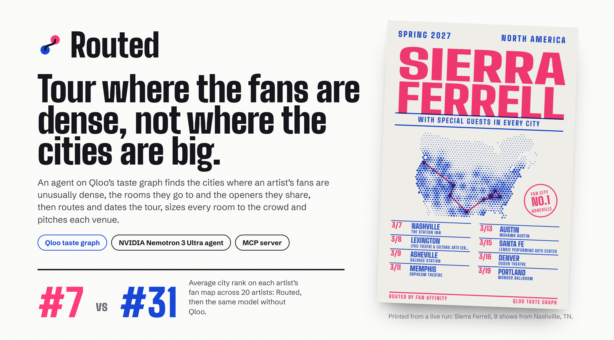
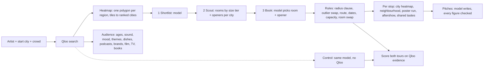

<p align="center"></p>

<p align="center">
  <a href="https://routed-tours.vercel.app"></a>
  
  
  
  <a href="https://github.com/RohanGlitched/routed/actions/workflows/ci.yml"></a>
  <a href="LICENSE"></a>
</p>

<p align="center">
  <b><a href="https://routed-tours.vercel.app">Route a tour</a></b> ·
  <b><a href="https://routed-tours.vercel.app/proof">With and without Qloo</a></b> ·
  <b><a href="https://routed-tours.vercel.app/how">How it works</a></b>
</p>

**Routed books an independent artist's tour where their fans are dense, not where the cities are big.** Name an artist, a starting city and the usual crowd. An agent reads Qloo's taste graph for the cities where that artist's fans are unusually dense, the rooms those fans already go to and the openers who share their audience, then routes and dates the tour by rule, sizes every room to the crowd, finds the neighbourhood in each city where the fans are, and drafts a hold request for every venue with each figure traced to its source. Run without Qloo, the same model sent Sierra Ferrell to Atlanta (#90 on her fan map) and Toronto (#202); Routed opened in Nashville, Lexington and Asheville.

It is for the people who route tours without a data team: independent artists, their managers, and the small agencies and promoters who book them. They pay for routing today in guesswork and dead rooms; Routed is the tool a manager would pay a monthly seat for, and a promoter would run in reverse.

## What a judge can check in a minute

- **Press "Route the tour"** on the home page (the form is pre-filled). A tour takes about a minute and streams its call sheet as it works: every Qloo question in plain words, with the exact request and what came back.
- **Open any day sheet.** The room holds a number with a source (Wikidata or a named web page), and it fits the usual crowd or the sheet says plainly that it doesn't and what the pitch asks instead. Under the date, a street-level map of the city: each dot a Qloo heatmap tile about 150 m across, the booked room marked, and the neighbourhood where the fans over-index most named from Qloo's own places there.
- **Scroll to "The same model, without Qloo".** The same model routed the same shows from memory before the agent looked anything up; both tours sit on one rank axis, scored on the artist's own heatmap.
- **Add to calendar** gives the tour as an .ics file with every show, travel day and day off; **Open in email** opens a pitch in your mail client; **Print the tour book** prints it.
- **Every Qloo call** is at the end of the tour book, about 70 per tour, and [the benchmark](https://routed-tours.vercel.app/proof) states what it can and can't show, with the exact baseline prompt.

## Why it needs Qloo

A manager deciding where to play has a streaming dashboard that counts plays, not people who'd buy a ticket, and a model that knows which cities are big. Neither says where *this* artist's fans are unusually dense, which rooms they go to, which neighbourhood they live in, or who they'd also turn up for. That is exactly what Qloo's graph holds.

| Question a booker asks | Qloo call |
|---|---|
| Where do this artist's fans over-index? | `/v2/insights` `filter.type=urn:heatmap`, `signal.interests.entities=<artist>`, `filter.location=<one WKT polygon per region>` |
| Where inside this city? | `/v2/insights` `filter.type=urn:heatmap`, `filter.location=POINT(<city>)`, `filter.location.radius` (a few hundred tiles about 150 m across) |
| Which rooms there do those fans go to, for a crowd this size? | `/v2/insights` `filter.type=urn:entity:place`, `filter.tags` chosen by the crowd's size tier (clubs and halls; halls, ballrooms and theatres; theatres, amphitheatres and arenas; arenas and stadiums), `filter.location=POINT` + `radius` |
| Who should open? | `/v2/insights` `filter.type=urn:entity:artist`, `signal.location`, `filter.popularity.max` and `.min` (clearly smaller than the headliner, not unknown) |
| What do the headliner's fans and the opener's fans share? | `/v2/analysis/compare` `a.signal.interests.entities=<headliner>`, `b.signal.interests.entities=<opener>` |
| Who are the fans? All-ages or 21+? | `/v2/insights` `filter.type=urn:demographics` |
| What do they listen to, how do they talk about it, what themes land? | `/v2/insights` `filter.type=urn:tag` with `filter.tag.types` = `urn:tag:genre:music`, `urn:tag:artist:qloo`, `urn:tag:theme:qloo` |
| Which podcasts, brands, films, TV and books? | `/v2/insights` `filter.type=urn:entity:podcast` / `brand` / `movie` / `tv_show` / `book` |
| Which dishes do they seek out? | `/v2/insights` `filter.type=urn:tag`, `filter.tag.types=urn:tag:specialty_dish:place` |
| Where would they see a poster, and go after? | `/v2/insights` `filter.type=urn:entity:place` with record store, bookshop and café tags within 2.5 km of the fans' hottest tile; then bar tags, per city |
| Is the audience growing? | `/v2/trending` (flat on the hackathon host for every artist tried, so it is shown only when it moves) |
| How well does each room match, ours and the model's? | `/v2/insights` `filter.type=urn:entity:place`, `filter.results.entities=<every room on both tours>` |

A typical eight-show tour makes about 70 Qloo calls. Every one is listed, with its plain-words question, the exact request (never the key) and the answer, at the end of its tour book.

## With and without Qloo

Twenty artists, eight shows each, run on the live site. The same model (Nemotron 3 Ultra), starting city and crowd size on both sides; the model alone gets the artist's name, Routed's agent gets Qloo. Each number is the average rank of a tour's cities among every touring city in the region on that artist's heatmap (lower is closer to the fans).

<!-- BENCH -->

Read this with Qloo's own ruler in mind: Routed chooses from the heatmap ranking it is then scored on, so the number shows how far a model routing from memory strays from where the taste graph puts the fans, not that the graph is right. The [benchmark page](https://routed-tours.vercel.app/proof) says so, gives the median stop and the share of stops in each artist's top ten (one #202 can't pull those), shows the exact baseline prompt, and names where the model alone keeps up: the UK, where touring cities are few and the biggest ones are also where the fans are. A model-alone city is placed by its name, then by the named room's coordinates on Qloo, then by Qloo's locality search; a stop that resolves to a town with no touring city near it counts last, and one that can't be placed at all is left out rather than counted against the model.

## Rooms sized to the crowd

Qloo tags a 150-cap bar and a 19,000-cap arena both as live music venues, so Routed asks for the kinds of room the crowd needs (four size tiers, by tag), measures the model's choice and then the city's best-known rooms until one fits, and swaps by rule: a room under 60% or over 250% of the usual crowd gives way to the first that fits, or failing that to the nearest size that could be confirmed. Capacities come from Wikidata's maximum-capacity property first (exact and free for theatres, ballrooms, amphitheatres and arenas), then from a web page that names the room, read by rule with the quote and source kept; social posts and buildings that don't exist yet are refused. When nothing fits, the day sheet says so and the pitch asks for a second night or a larger room instead of calling the room a fit. Openers are clearly smaller than the headliner by Qloo popularity and never share a word of the headliner's name, so a band's own singer can't come back as its support.

## Inside each city

For every stop Routed asks Qloo for the heatmap of that one city: a few hundred tiles about 150 m across. A rule finds the hottest tile, names the neighbourhood from the shops and bars Qloo files there (with how Qloo characterises it: a creative hub, a historic district), measures the booked room against it, and anchors the poster run on it, so posters go up where the fans live. The map sits under the date on every day sheet, and the pitch can say "the venue sits in Buckman, where the heatmap shows the strongest concentration" because the evidence line does.

## Use it from your own agent

Routed is also an MCP server (Streamable HTTP). Add `https://routed-tours.vercel.app/api/mcp` to any assistant that supports remote MCP servers and it gets five tools:

| Tool | What it does |
|---|---|
| `fan_map` | Where an artist's fans over-index in North America, the UK and Ireland, or mainland Europe |
| `fan_neighbourhoods` | Where inside one city, with the record stores and cafés there for a poster run |
| `fan_profile` | Who the fans are: door advice, sound, mood, themes, dishes, podcasts, brands, films, TV, books |
| `route_tour` | A whole tour in about a minute, with the dates, rooms, openers and a link to the tour book |
| `get_tour` | Reads back a tour book by its link |

## How it works



- **The agent (NVIDIA Nemotron 3 Ultra on Nebius Token Factory)** works in three moves: it shortlists cities from the ranked heatmap with a few alternates, Routed scouts each one through Qloo, and the model books a room and an opener per city, swapping in an alternate when a city's rooms don't fit. Every call returns strict JSON with reasoning off.
- **Rules decide what must be exact**: cities only from Qloo's candidates, no two shows within 150 km, a stop that costs a leg over 1,800 km swapped for the strongest unused city within reach, the shortest drive (nearest neighbour then 2-opt), at most 8 hours of driving on a show day, a day off after five shows, the room sized to the crowd, and a room that misses it swapped. When a rule changes the room or the opener the model chose, the model's sentence about the stop is replaced by a rule's, so a wrong name never stays on the page.
- **Pitches are checked**: Nemotron writes each hold request from that stop's evidence lines only; every number in it must appear in the evidence or it is struck through on the page.
- **City strength** is a tile's Qloo affinity times its popularity, both from one heatmap call per region. Affinity and popularity are percentiles within the response they came in (measured: both run evenly from 0 to 1 in every response), so two countries asked separately would each have a "1.0" tile; one polygon, one scale. Affinity alone crowns one-tile hot spots (Indio, which is the Coachella grounds).
- **The artist someone typed wins** over Qloo's first guess ("Wednesday" is not "Wednesday Campanella"), and the other matches are offered on the tour book.
- **Fallbacks**: with no model key, a spent daily budget or a model error, the same steps run as a fixed plan with template pitches, and the tour book says which ran. A run survives a closed tab; the record is saved as it goes.

## Run it

```bash
git clone https://github.com/RohanGlitched/routed && cd routed
npm install
cp .env.example .env.local   # then fill in the keys
npm run dev                  # http://localhost:3000
npm test                     # 27 unit tests: routing rules, room rules, scoring, capacity parsing, evidence checks, the city map, the calendar file
```

| Variable | Needed for |
|---|---|
| `QLOO_API_KEY` | Every Qloo call (hackathon host `https://hackathon.api.qloo.com`, header `X-Api-Key`) |
| `QLOO_BASE_URL` | Optional, defaults to the hackathon host |
| `NEBIUS_API_KEY` | The agent, the control group and the pitches. Without it, the fixed plan and template pitches run |
| `TAVILY_API_KEY` | Optional: room capacities use Wikidata first and Tavily's keyless mode second; set `TAVILY_USE_KEY=1` to search with this key instead |
| `GCS_BUCKET` + `GCS_WIF_AUDIENCE` | Tours, the daily counters and the capacity cache in a Google Cloud Storage bucket, keyless: the function's Vercel OIDC token is exchanged for a token on the bucket (or `GCS_SA_KEY`, a base64 service-account JSON; or `BLOB_READ_WRITE_TOKEN` for Vercel Blob). Without any, tours are files under `.data/` |
| `DAILY_MODEL_CAP`, `QLOO_DAILY_CAP`, `MCP_DAILY_CAP` | Daily allowances for the public demo (model runs, Qloo requests, tours routed through the MCP endpoint) |
| `ADMIN_TOKEN` | Optional: shelving tours on the poster wall and the benchmark (`scripts/bench.mjs`) |

`node scripts/probe-qloo.mjs "Artist"` measures every Qloo call Routed depends on and saves the raw responses, which is how the tags, the polygons and the scoring were chosen. `node scripts/bench.mjs <url>` runs the benchmark; `scripts/bench-table.mjs` prints the table above from the finished tours.

## What Routed doesn't know

- Qloo affinity says where fans over-index, not how many tickets will sell. It's the first question a booker asks, not the last. The benchmark measures with Qloo's own ruler and says so.
- Availability, offers and guarantees come from the rooms; the pitch asks for them.
- Capacities come from Wikidata and web pages, read by rule; the source is linked, and some are still wrong.
- The figure check asks whether each number in a pitch appears in the stop's evidence. A true figure written another way is struck; a wrong figure that happens to match another number passes.
- Qloo's trend series is flat on the hackathon host for every artist tried, so momentum is shown only when it moves.
- Qloo sometimes merges two acts with one name. Routed takes the exact name match when there is one, Qloo's best match otherwise, and offers the other matches.
- Routed sends Qloo only public names (artists, cities, venues). It collects no personal data.

## Credits

Taste data from [Qloo](https://www.qloo.com). Agent and pitches by NVIDIA Nemotron on Nebius Token Factory. Capacities via [Wikidata](https://www.wikidata.org) and Tavily. Cities from [GeoNames](https://www.geonames.org) (CC BY 4.0); coastlines from Natural Earth. Type: Big Shoulders and Schibsted Grotesk.

MIT licence.
